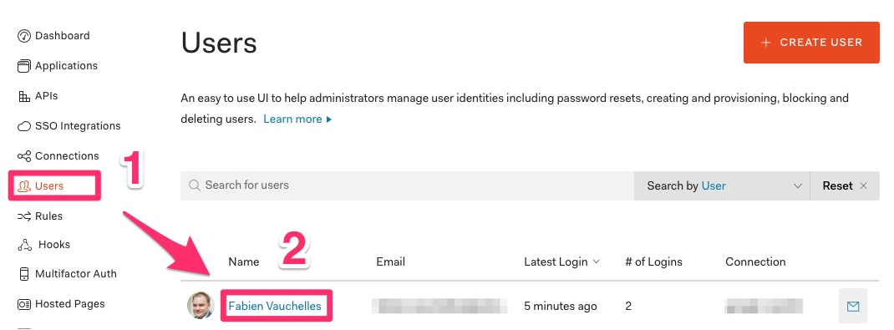
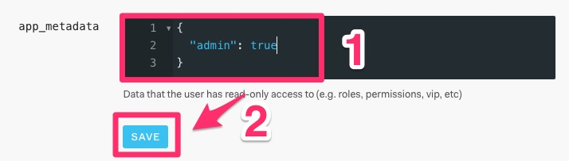
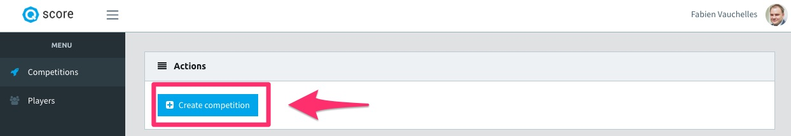

================================
Tutorial: Make yourself an admin
================================

Step 1: Login to Auth0
----------------------

Go back to https://manage.auth0.com/

Step 2: Open the users list
---------------------------

1. Select *Users* in the sidebar
2. Click on your name

Step 3: Change your role to admin
---------------------------------

1. Find *app_metadata* (don't mix up with *user_metadata*)
2. Add the following JSON:

.. code-block:: json

    {
        "admin": true
    }

3. Click on *Save*

Step 4: Logout on and login to QScore
-------------------------------------

Go to http://localhost:3000, logout and login.

You should be an admin:

