===============================
Tutorial: Get Auth0 credentials
===============================

Part A: Create an Auth0 account
===============================

Step 1: Sign Up
---------------

Go to https://auth0.com/ and click on *Sign Up*

Step 2: Register
----------------

Enter your email and password and click on *Next*:

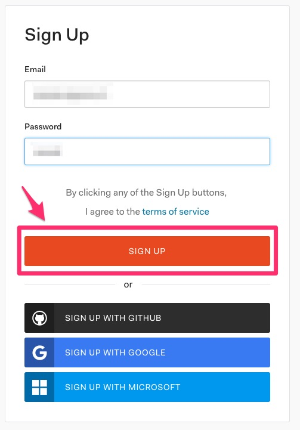

Step 3: Choose your tenant
--------------------------

1. Fill the tenant
2. Select your region (where data are stored)
3. And click on *Next*

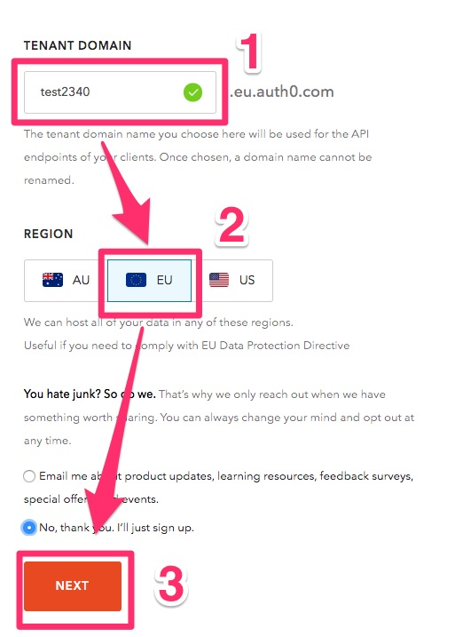

Step 4: Finalize your account
-----------------------------

1. Fill the information according to your profile
2. Click on *Create Account*

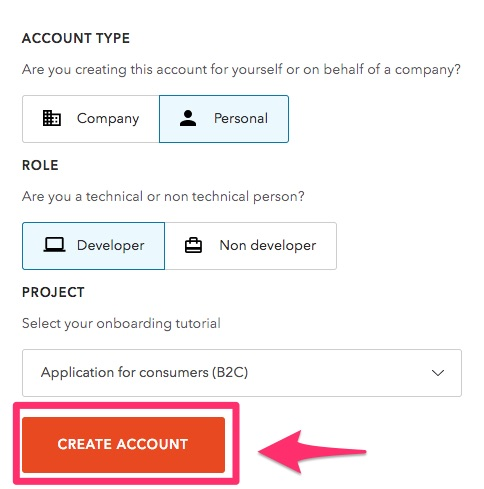

Part B: Create a new application
================================

Step 1: Open the new application form
-------------------------------------

1. Select *Application* in the sidebar
2. Click on *Create Application*

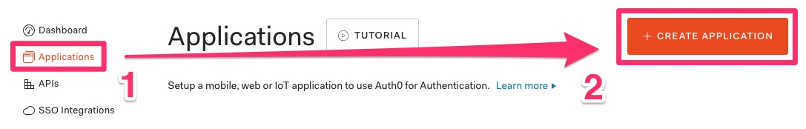

Step 2: Set the parameters
--------------------------

1. Choose a name for your Application
2. Select *Single Page Web Applications*
3. And click on *Create*

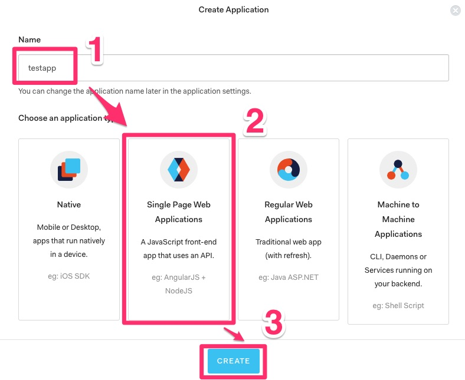

Step 3: Get the parameters
--------------------------

1. Select *Settings*
2. Remember *Domain* and *Client ID*

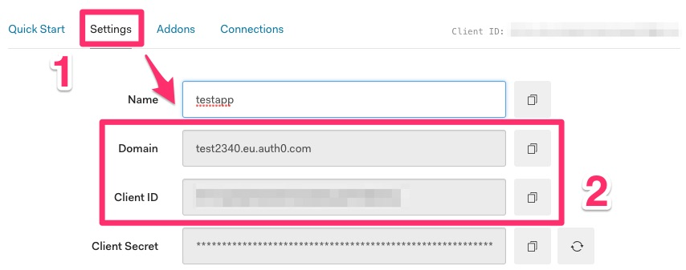

Step 4: Set the callback URL
----------------------------

In *Allowed Callback URLs*, write your server URL :

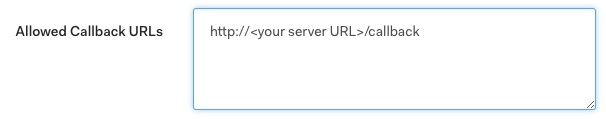

Step 5: Save the application
----------------------------

Click on *Save Changes*

Part C: Create a new API endpoint
=================================

Step 1: Open the new API form
-----------------------------

1. Select *APIs* in the sidebar
2. Click on *Create API*

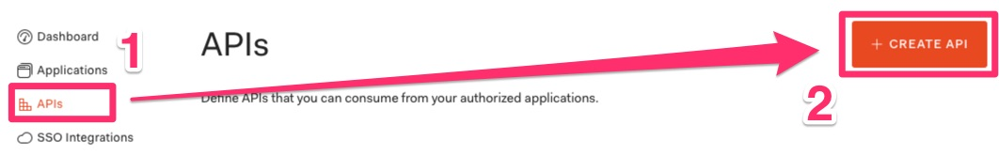

Step 2: Set the parameters
--------------------------

1. Choose a name for your API
2. Choose a random Identifier and remember it
3. Select *RS256* for the signing algorithm
4. Click on *Create*

.. image:: step_11.jpg

Step 3: Save the API
--------------------

Click on *Save*

Part D: Create Admin rule
=========================

Step 1: Open the new Rule form
------------------------------

1. Select *Rules* in the sidebar
2. Click on *Create your first rule*

.. image:: step_13.jpg

Step 2: Choose an empty rule template
-------------------------------------

1. Click on *empty rule*

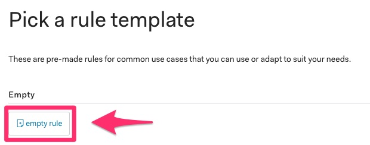

Step 3: Edit the new rule
-------------------------

1. In the title, enter *Admin For Metadata*
2. In the code, enter:

.. code-block:: js

    function (user, context, callback) {
      var requestedScopes = (
        context.request.body.scope ||
        context.request.query.scope
      )
        .split(' ');

      if (user.app_metadata &&
          user.app_metadata.admin) {
        requestedScopes.push('admin');
      }

      context.accessToken.scope = requestedScopes.join(' ');

      callback(null, user, context);
    }

3. And click on *Save*

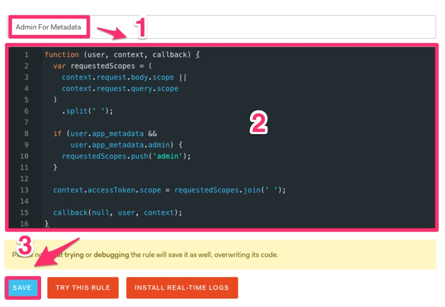

Part E: Authentification providers
==================================

Select *Connections* in the sidebar

And configure your favorite authentification provider.

By default, Google is enabled.

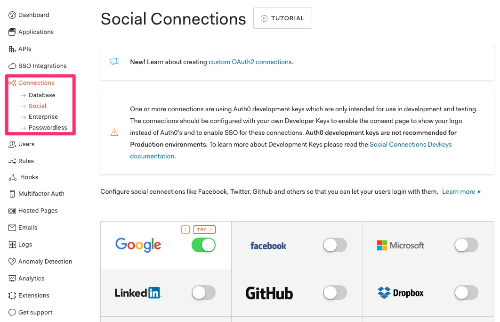

